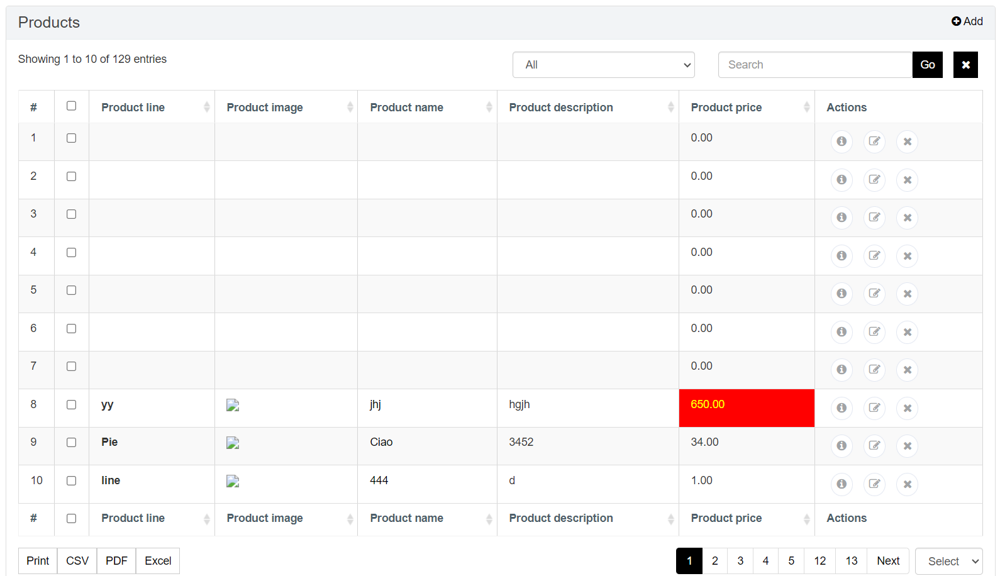

# Функциональное тестирование таблицы

Перед нами таблица, для которой предоставляется возможность сортировки по каждому столбцу, а также возможность фильтрации по значению ячейки.  

## Тестовые сценарии

_Состояние по умолчанию_ — устанавливается при переходе на сайт.

### 1. Фильтры

#### 1.1 Позитивный корректный поиск

   **Начальное состояние**. Состояние по умолчанию.
   
   **Действия**. 
   
   — Пользователь вводит **_имеющееся_** в таблице значение ячейки в поле фильтра.
   
   — Кликает Go. 
   
   **Ожидаемый результат**. Отображаются строки таблицы, содержащие занчение фильтра.

#### 1.2 Негативный корректный поиск

   **Начальное состояние**. Состояние по умолчанию.
   
   **Действие**. 
   
   — Пользователь вводит **_отсутствующее_** в таблице значение ячейки в поле фильтра.
   
   — Кликает Go.
   
   **Ожидаемый результат**. Отображается сообщение _«No records found»_.

#### 1.3 Поиск со спецсимволами в фильтре

   **Начальное состояние**. Состояние по умолчанию.
   
   **Действие**. 
   
   — Пользователь вводит строку со спецсимволами в поле фильтра.
   
   — Кликает Go.
   
   **Ожидаемый результат**. Отображается сообщение _«No records found»_.

#### 1.4 Поиск с русскими буквами в фильтре

   **Начальное состояние**. Состояние по умолчанию.
   
   **Действие**.
   
   — Пользователь вводит строку, состоящую из букв русского алфавита в поле фильтра.
   
   — Кликает Go.
   
   **Ожидаемый результат**. Отображается сообщение _«No records found»_.

#### 1.5 Отмена фильтра

   **Начальное состояние**. 
   
   Состояние по умолчанию.
   
   — Пользователь вводит **_имеющееся_** в таблице значение ячейки в поле фильтра.
   
   — Кликает Go.
   
   **Действие**.
   
   — Пользователь очищает поле фильтра.
   
   — Кликает Go.
   
   **Ожидаемый результат**. Количество записей соответствует количеству в состоянии по умолчанию.

### 2. Сортировки

#### 2.1 Сортировка по возрастанию

   **Начальное состояние**. Состояние по умолчанию.
   
   **Действие**.
   
   — Пользователь кликает **1 раз** по названию столбца в строке заголовков таблицы.
   
   **Ожидаемый результат**. Записи на странице отсортированы по возрастанию значения в соответствующем столбце.
   
   _Повторить с каждым столбцом кроме «Product Image»._

#### 2.2 Сортировка по убыванию

   **Начальное состояние**. Состояние по умолчанию.
   
   **Действие**.
   
   — Пользователь кликает **2 раза** по названию столбца в строке заголовков таблицы.
   
   **Ожидаемый результат**. Записи на странице отсортированы по убыванию значения в соответствующем столбце.
   
   _Повторить с каждым столбцом кроме «Product Image»._

#### 2.3 Позитивная сортировка с фильтром по возрастанию

   **Начальное состояние**.
   
   Состояние по умолчанию.
   
   — Пользователь вводит в поле фильтра значение ячейки, встречающееся в **нескольких** записях таблицы.
   
   — Кликает Go.
   
   **Действие**. Выполнить действия сортировки по возрастанию для столбца, **НЕ СОДЕРЖАЩЕГО** значение фильтра.
   
   **Ожидаемый результат**. Записи на странице отсортированы по возрастанию значения в соответствующем столбце.
   
   _Выполнить аналогично сортировку по убыванию с фильтром._

#### 2.4 Негативная сортировка с фильтром

   **Начальное состояние**.
   
   Состояние по умолчанию.
   
   — Пользователь вводит в поле фильтра значение ячейки, встречающееся в **нескольких** записях таблицы.
   
   — Кликает Go.
   
   **Действие**. Выполнить действия сортировки по возрастанию для столбца, **СОДЕРЖАЩЕГО** значение фильтра.
   
   **Ожидаемый результат**. Порядок записей на странице не изменится.
   
   _Выполнить аналогично сортировку по убыванию с фильтром._

### 3. Чекбоксы

#### 3.1 Удаление одного выбранного элемента
   
   **Начальное состояние**. Состояние по умолчанию.
   
   **Действие**.
   
   — Пользователь переводит чекбокс одной записи во включённое состояние.
   
   — Пользователь кликает по кнопке с изображением крестика для удаления выбранной записи.
   
   **Ожидаемый результат**. Последняя запись на странице изменяется.

#### 3.2 Удаление нескольких выбранных элементов

   **Начальное состояние**. Состояние по умолчанию.
   
   **Действие**.
   
   — Пользователь переводит чекбоксы N записей во включённое состояние.
   
   — Пользователь кликает по кнопке с изображением крестика для удаления N выбранных записи.
   
   **Ожидаемый результат**. Последние N запиcей на странице изменяются.

### 4. Управление страницами таблицы

#### 4.1 Изменение количества отображаемых записей на одной странице

   **Начальное состояние**. Состояние по умолчанию.
   
   **Действие**.
   
   — Пользователь выбирает желаемое количество записей, отображаемых на странице.
   
   **Ожидаемый результат**. Отображается соответствующее количество записей и соответствующее сообщение об отображаемых зсписях.

#### 4.2 Простой переход на следующую страницу

   **Начальное состояние**. Состояние по умолчанию.
   
   **Действие**.
   
   — Пользователь кликает по номеру следующей страницы.
   
   **Ожидаемый результат**. Первая запись на следующей странице начинается с n+1-ой записи, где n — номер последней записи на предыддущей странице. Первая запись на новой странице отличается от первой записи на предыдущей странице. Сообщение об отображаемых зсписях изменяется соответствующим образом.
   
   _Назовём данный результат **корректным переходом**. НЕобходимо также протестировать переход на страницу в середине и на последнюю страницу, а также возвращение на первую._

#### 4.3 Переход с фильтром

   **Начальное состояние**. 
   
   Состояние по умолчанию.

   — Пользователь вводит в поле фильтра значение ячейки, встречающееся в **нескольких** записях таблицы.
   
   — Кликает Go.

   **Действие**.
   
   — Пользователь кликает по номеру следующей страницы.
   
   **Ожидаемый результат**. _Корректный переход._ Все значения соответствующего столбца соответствуют значению фильтра. Значение фильтра по-прежнему отображается в поле фильтра. Сообщение об отображаемых зсписях изменяется соответствующим образом.

#### 4.4 Переход с сортировкой

   **Начальное состояние**.
   
   Состояние по умолчанию.
   
   — Пользователь кликает **1 раз** по названию столбца в строке заголовков таблицы.
   
   **Действие**.
   
   — Пользователь кликает по номеру следующей страницы.
   
   **Ожидаемый результат**. _Корректный переход._ Все значения соответствующего столбца отсортированы в порядке возрастания. Состояние сортировки отображается в строке заголовков таблицы соответственно. Сообщение об отображаемых зсписях изменяется соответствующим образом.

## Результаты

Тесты 1.4, 2.4, 4.3, 4.4 завершаются с ошибкой, так как не соответствуют ожидаемому поведению, определённому в требованиях для данного сайта и описанных в данном файле в соответствующих пунктах.
Описание реального (некорректного) поведения: 
   
1.4 — при выполнении поиска с русскими буквами в фильтре отображается ошибка на стороне бекэнд вместо сообщения о невалидном значении фильтра или сообщения _«No records found»_.

2.4 — при негативной сортировке с фильтром порядок записей на странице изменяется по неопределённой логике.

4.3 — фильрация при переходе между страницами работает корректно, при этом значение фильтра не отображается в поле фильтра после перехода.
 
4.4 — сортировка полностью сбрасывается при переходе между страницами.

Тестовыми сценариями, описанными в данном файле, не охватывается выгрузка данных в различных форматах и действия, доступные для каждой записи и отображаемые в последнем столбце.